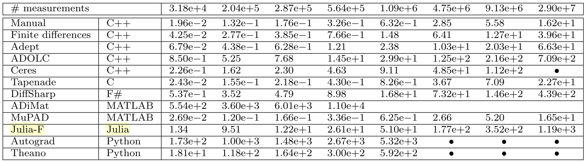

# NiBundleAdjustment

Generate Jacobians for Bundle Adjustment application with NiLang and ForwardDiff.

The motivation is to beat the benchmark in this [paper](https://arxiv.org/abs/1807.10129), for the glory of Julia community!

[](https://travis-ci.com/JuliaReverse/NiBundleAdjustment.jl)
[](https://codecov.io/gh/JuliaReverse/NiBundleAdjustment.jl)

## Get started!

Open a Julia REPL and type `]` to enter `pkg` mode and then type
```julia pkg
pkg> dev git@github.com:JuliaReverse/NiBundleAdjustment.jl.git
pkg> add ForwardDiff BenchmarkTools
```

Then in a bash shell, type the following commands to open the benchmark file in Atom.
```bash
$ julia ~/.julia/dev/NiBundleAdjustment/benchmarks/benchmark.jl
```

You will see results like:
```julia repl
Normal Objective
BenchmarkTools.Trial:
  memory estimate:  0 bytes
  allocs estimate:  0
  --------------
  minimum time:     59.942 ns (0.00% GC)
  median time:      60.138 ns (0.00% GC)
  mean time:        65.153 ns (0.00% GC)
  maximum time:     199.957 ns (0.00% GC)
  --------------
  samples:          10000
  evals/sample:     988

Reversible Objective
BenchmarkTools.Trial:
  memory estimate:  0 bytes
  allocs estimate:  0
  --------------
  minimum time:     107.617 ns (0.00% GC)
  median time:      108.738 ns (0.00% GC)
  mean time:        110.055 ns (0.00% GC)
  maximum time:     236.161 ns (0.00% GC)
  --------------
  samples:          10000
  evals/sample:     932
  
ForwardDiff Gradient
BenchmarkTools.Trial:
  memory estimate:  528.84 MiB
  allocs estimate:  4907333
  --------------
  minimum time:     646.650 ms (6.45% GC)
  median time:      878.898 ms (18.77% GC)
  mean time:        905.952 ms (21.36% GC)
  maximum time:     1.388 s (32.71% GC)
  --------------
  samples:          6
  evals/sample:     1
  
NiLang Gradient
BenchmarkTools.Trial:
  memory estimate:  48.36 MiB
  allocs estimate:  5
  --------------
  minimum time:     167.203 ms (0.00% GC)
  median time:      187.738 ms (0.49% GC)
  mean time:        200.598 ms (7.51% GC)
  maximum time:     366.429 ms (43.97% GC)
  --------------
  samples:          25
  evals/sample:     1
```

Note: the memory usage is not yet fully optimized. We can still trade some space for time.

It corresponds to the second column of ADBench paper


We see our ForwardDiff result is 16x faster than the original version, it still has some room for optimization as can be seen from the allocations in our benchmark.
NiLang is even faster. Here the Jacobian is computed by glueing the Jacobians of a function with 15 input parameters and 2 output parameters. This is why NiLang does not have much advantage comparing with forward mode AD.
