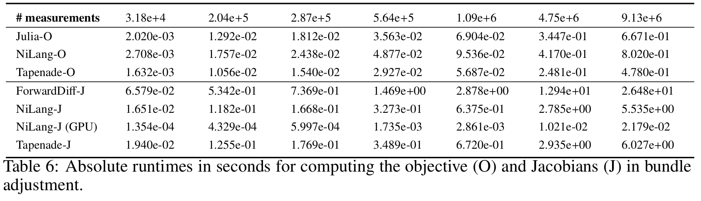

# NiBundleAdjustment

Generate Jacobians for Bundle Adjustment application with NiLang and ForwardDiff.

The motivation is to beat the benchmark in this [paper](https://arxiv.org/abs/1807.10129), for the glory of Julia community!

[](https://travis-ci.com/JuliaReverse/NiBundleAdjustment.jl)
[](https://codecov.io/gh/JuliaReverse/NiBundleAdjustment.jl)

## Get started!

Open a Julia REPL and type `]` to enter `pkg` mode and then type
```julia pkg
pkg> dev git@github.com:JuliaReverse/NiBundleAdjustment.jl.git
pkg> add ForwardDiff BenchmarkTools StaticArrays
```

Then in a bash shell, type the following commands to open the benchmark file in Atom.
```bash
$ julia ~/.julia/dev/NiBundleAdjustment/benchmarks/benchmark.jl
```

You will see results like:
```julia repl
Normal Objective
BenchmarkTools.Trial: 
  memory estimate:  0 bytes
  allocs estimate:  0
  --------------
  minimum time:     38.272 ns (0.00% GC)
  median time:      38.409 ns (0.00% GC)
  mean time:        38.581 ns (0.00% GC)
  maximum time:     1.519 μs (0.00% GC)
  --------------
  samples:          10000
  evals/sample:     992
Reversible Objective
BenchmarkTools.Trial: 
  memory estimate:  0 bytes
  allocs estimate:  0
  --------------
  minimum time:     73.986 ns (0.00% GC)
  median time:      74.485 ns (0.00% GC)
  mean time:        74.558 ns (0.00% GC)
  maximum time:     100.832 ns (0.00% GC)
  --------------
  samples:          10000
  evals/sample:     972
NiLang Gradient
BenchmarkTools.Trial: 
  memory estimate:  48.36 MiB
  allocs estimate:  5
  --------------
  minimum time:     117.601 ms (0.00% GC)
  median time:      120.190 ms (2.29% GC)
  mean time:        122.620 ms (4.00% GC)
  maximum time:     190.643 ms (38.32% GC)
  --------------
  samples:          41
  evals/sample:     1ForwardDiff Gradient
BenchmarkTools.Trial: 
  memory estimate:  528.84 MiB
  allocs estimate:  4907333
  --------------
  minimum time:     391.512 ms (4.84% GC)
  median time:      453.953 ms (18.51% GC)
  mean time:        495.568 ms (16.87% GC)
  maximum time:     607.950 ms (30.33% GC)
  --------------
  samples:          11
  evals/sample:     1
```

Note: CPU: Intel(R) Xeon(R) Gold 6230 CPU @ 2.10GHz.

It corresponds to the second column of ADBench paper


We see our ForwardDiff result is 16x faster than the original version, it still has some room for optimization as can be seen from the allocations in our benchmark.
NiLang is even faster. Here the Jacobian is computed by glueing the Jacobians of a function with 15 input parameters and 2 output parameters. This is why NiLang does not have much advantage comparing with forward mode AD.
